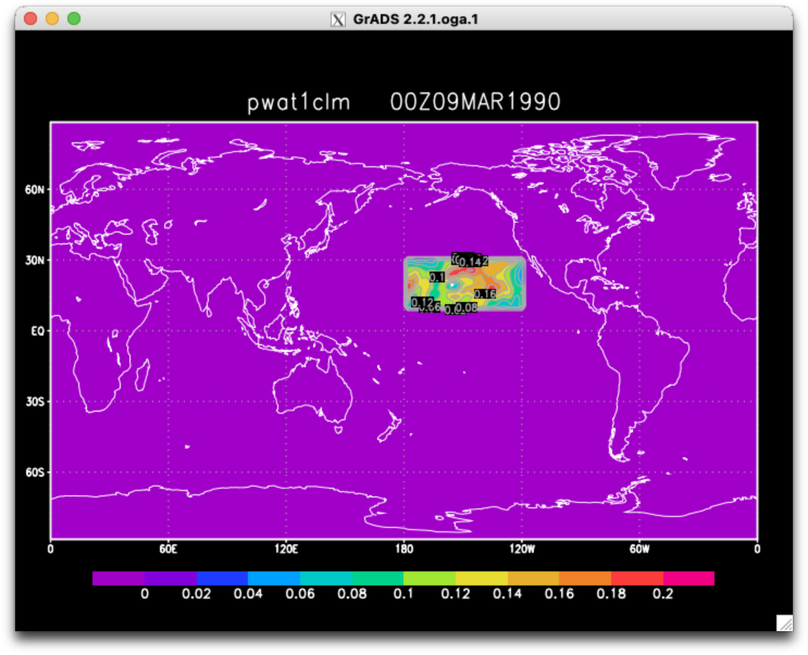
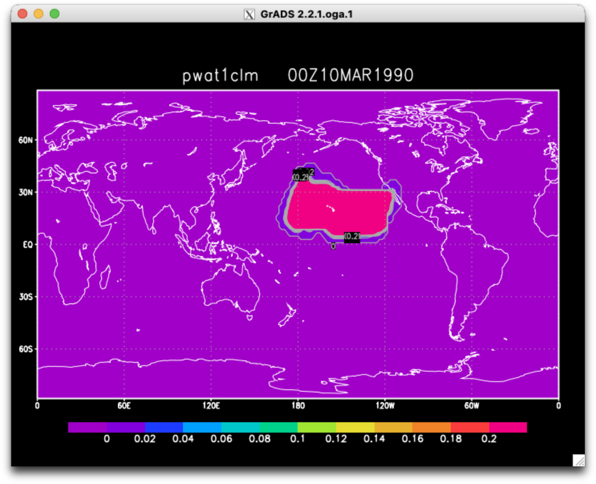
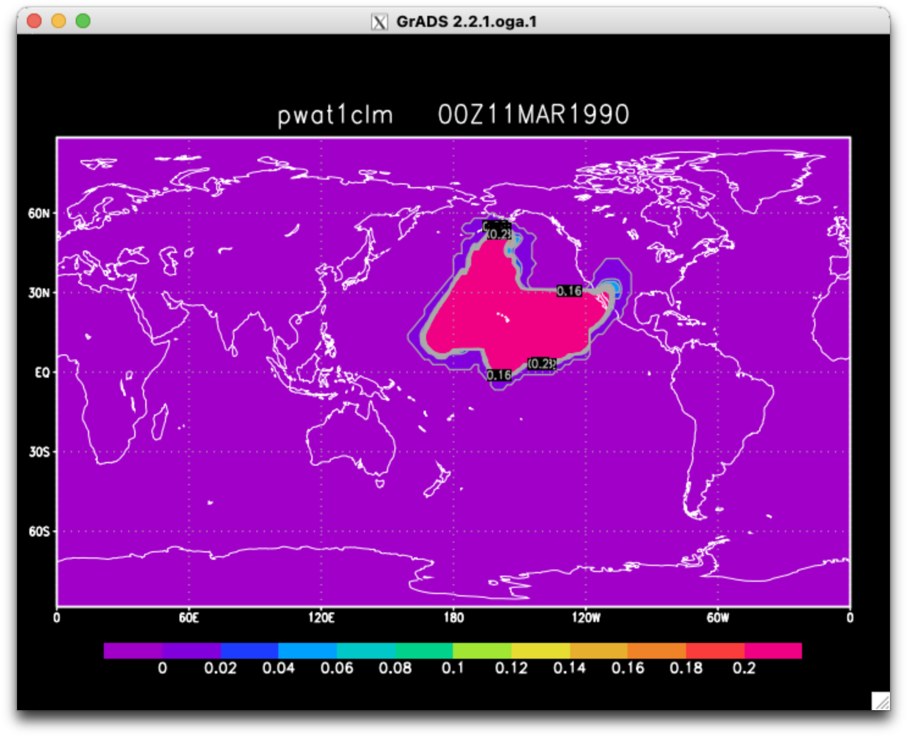
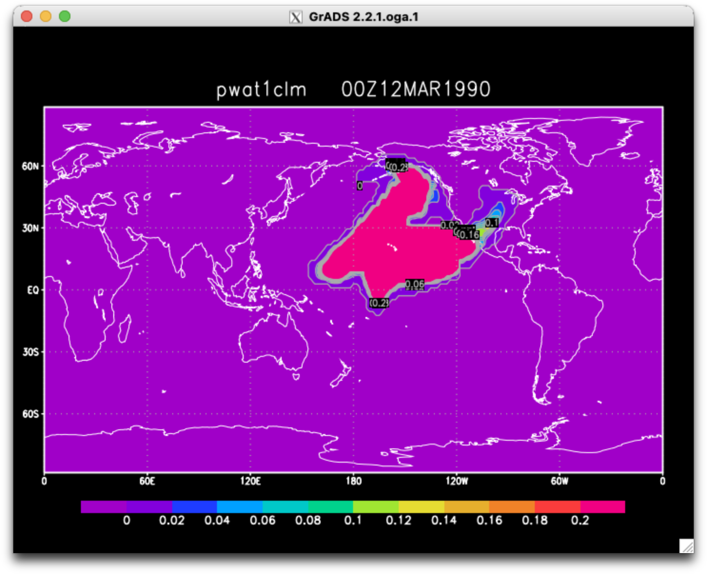

# IsoGSM-Mac-updater


### Step 1. Put the three files in the IsoGSM_Mac folder

- build.sh
- fix_mpi_parallel_macos.patch
- fix_segfault_macos_arm64.patch
 
### Step 2. Run build.sh

```
$ sh build.sh
```

### Step 3. Run GSM simulation

```
cd ../gsm_runs
./configure-scr gsm
./gsm
cd g_000  
cp ../pgb.ctl ./
cp ../flx.ctl ./
gribmap –i pgb.ctl
gribmap –i flx.ctl
```

### Step 4. Visualization

```
/Application/OpenGrADS/opengrads 
> open flx.ctl
> d pwatclm
> set t 1 21
> xanim -pause pwat1clm
```







